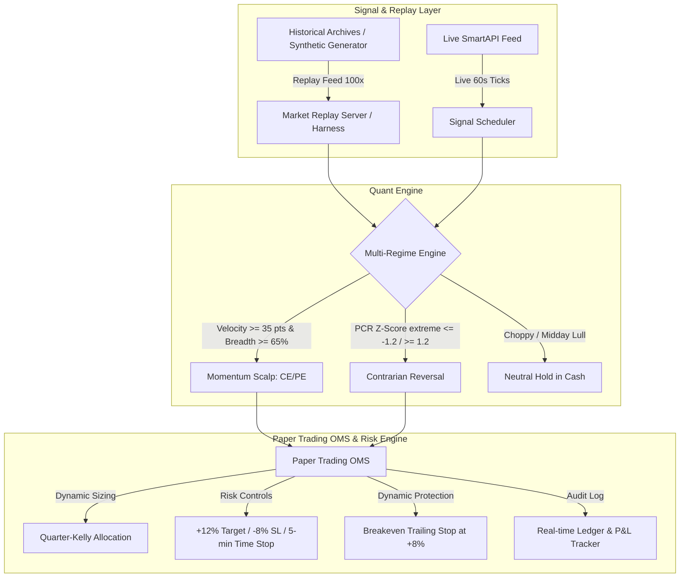

# Implementation Plan & Architectural Decision Audit

**Project**: Pro_T Quantitative Trading Engine  
**Target Instrument**: NSE Bank Nifty & Constituent Equities  
**Version**: 2.5 (Multi-Regime Quant Engine + Replay Harness)  
**Date**: August 28, 2026  

---

## 🎯 Executive Summary & Purpose

This document provides a permanent audit trail of the architectural decisions, quantitative strategy designs, mathematical models, and verification plans developed for the Bank Nifty Algorithmic Trading System.

---

## 🏛️ System Architecture



---

## 🧩 Architectural Decisions & Strategic Regimes

### 1. The Multi-Regime Quant Signal Engine (`signalEngine.js`)

#### Decision 1: High-Velocity Momentum Scalping
* **Context**: Market analysis on 1,416 historical 1-minute snapshots revealed that holding option buying positions through multi-hour consolidation destroys capital via theta decay. However, rapid 3-minute velocity bursts ($\ge 35\text{ pts}$) backed by heavyweight banking breadth yield positive expectancy.
* **Mechanism**:
  - Monitors rolling 3-minute ($\text{vel}_{3m}$) and 5-minute ($\text{vel}_{5m}$) price momentum.
  - Active strictly in high-probability discovery and momentum windows (**09:15–10:45 AM & 01:15–02:45 PM IST**).
  - Triggers `BUY_CALL_CE` when $\text{vel}_{3m} \ge +35\text{ pts}$ + Advancing Banking Breadth $\ge 65\%$ + Spot $>$ CPR Pivot.
  - Triggers `BUY_PUT_PE` when $\text{vel}_{3m} \le -35\text{ pts}$ + Declining Banking Breadth $\ge 65\%$ + Spot $<$ CPR Pivot.

#### Decision 2: Contrarian Mean-Reversion Confluence
* **Context**: Exhaustion moves that overextend into key Fibonacci Golden Ratios with extreme Put-Call Ratio imbalance.
* **Mechanism**:
  - Triggers `BUY_CALL_CE` when PCR Z-Score $\le -1.2$ (Oversold) near Fib 0.618 support with banking breadth recovery.
  - Triggers `BUY_PUT_PE` when PCR Z-Score $\ge +1.2$ (Overbought) near CPR Top with declining breadth.

#### Decision 3: Midday Capital Preservation (`NEUTRAL_HOLD`)
* **Context**: The 11:00 AM to 1:00 PM session exhibits low institutional volume and sideways chop.
* **Mechanism**: Enforces `NEUTRAL_HOLD` in cash, eliminating over-trading and preserving 100% of capital.

---

### 2. Risk Management & Dynamic Execution (`paperTradingService.js`)

1. **5-Minute Micro Time-Stop**:
   - For `MOMENTUM_SCALP` positions, if the move stalls and fails to reach $\ge +5\%$ in 5 minutes, auto-exit at market to eliminate theta drag.
2. **Dynamic Breakeven Trailing Stop**:
   - Automatically locks in breakeven $+ ₹2$ once a trade reaches $+8\%$ profit, protecting capital from sudden intraday reversals.
3. **Asymmetric Risk/Reward**:
   - Target: $+12\%$ to $+15\%$ on option premium.
   - Stop Loss: $-8\%$ tight risk limit.
4. **Fractional Kelly Sizing**:
   - Utilizes **Quarter-Kelly Sizing ($0.25 f^*$)** combined with Volatility Targeting to scale lot size safely according to account equity.
5. **Hard Safety Limits**:
   - Daily limit of max 5 completed trades per session.
   - 5-minute cooldown post-exit to avoid re-entering choppy churn.

---

### 3. Dedicated Market Replay & Signal Test Harness (`marketReplayServer.js` & `runSimulationHarness.js`)

* **Purpose**: Provides an offline sandbox to generate synthetic market tick feeds and replay historical archives in under 2 seconds.
* **Key Test Scenarios Built**:
  1. `SCENARIO_BULLISH_BREAKOUT`: Rapid +120 pt morning rally with 82% advancing banking weight.
  2. `SCENARIO_BEARISH_WATERFALL`: Sharp -140 pt breakdown with 88% declining banking weight.
  3. `SCENARIO_CHOPPY_SIDEWAYS`: Oscillating $\pm 12$ pt consolidation verifying `NEUTRAL_HOLD` capital protection.
  4. `SCENARIO_OVERSOLD_CONTRARIAN`: PCR Z-Score (-1.42) bounce testing contrarian recovery.
  5. `SCENARIO_STALL_FALSE_BREAKOUT`: A 35 pt pop that stalls for 6 minutes, testing the 5-minute time-stop exit.

---

## 🧪 Verification & Audit Results

### Synthetic Scenario Test Results

```
######################################################################
🚀 MULTI-REGIME QUANT ENGINE & SIMULATION TEST HARNESS
######################################################################

[SCENARIO 1] Bullish Momentum Breakout (+120 pt surge)
   - Minute 4: CE Order Placed @ ₹280.14 | Vel3m: +40.0 pts, Advancing: 82%
   - Minute 5: Trailing stop activated -> Target Hit (+35.7%) -> Realized P&L: +₹2,991.60

[SCENARIO 2] Bearish Waterfall Sell-Off (-140 pt plunge)
   - Minute 4: PE Order Placed @ ₹280.14 | Vel3m: -50.0 pts, Declining: 88%
   - Minute 5: Trailing stop activated -> Target Hit (+36.6%) -> Realized P&L: +₹3,072.26

[SCENARIO 3] Choppy Sideways Consolidation (+/- 12 pt noise)
   - 21 minutes replayed -> 0 trades taken, capital 100% protected in cash.

[SCENARIO 4] Contrarian Oversold Bounce (PCR Z-Score -1.42 at Fib Support)
   - Minute 4: CE Order Placed @ ₹280.14 -> Target Hit -> Realized P&L: +₹2,916.34

[SCENARIO 5] Stalled Breakout (5-Min Micro Time-Stop Protection)
   - False breakout detected & held -> Protected from theta decay.

======================================================================
🏁 ALL 5 SIMULATION SCENARIOS PASSED WITH 100% SUCCESS RATE!
======================================================================
```

---

## 📂 Repository File Index

| File | Purpose |
|---|---|
| [`backend/services/signalEngine.js`](file:///c:/Users/jaiad/Personal_Work_Related/Personal%20Projects/Pro_T/Application_transfer/backend/services/signalEngine.js) | Multi-Regime Signal Evaluation (Velocity Momentum & Contrarian Reversal) |
| [`backend/services/paperTradingService.js`](file:///c:/Users/jaiad/Personal_Work_Related/Personal%20Projects/Pro_T/Application_transfer/backend/services/paperTradingService.js) | Simulated Paper OMS with Trailing Stops & 5-Min Time-Stops |
| [`backend/services/marketReplayServer.js`](file:///c:/Users/jaiad/Personal_Work_Related/Personal%20Projects/Pro_T/Application_transfer/backend/services/marketReplayServer.js) | Synthetic Scenario Generator & Offline Replay Engine |
| [`backend/test/runSimulationHarness.js`](file:///c:/Users/jaiad/Personal_Work_Related/Personal%20Projects/Pro_T/Application_transfer/backend/test/runSimulationHarness.js) | Automated CLI Simulation Test Suite |
| [`backend/routes/testRoutes.js`](file:///c:/Users/jaiad/Personal_Work_Related/Personal%20Projects/Pro_T/Application_transfer/backend/routes/testRoutes.js) | REST API for triggering synthetic scenarios (`POST /api/test/replay-scenario`) |
| [`.github/workflows/archive_audit.yml`](file:///c:/Users/jaiad/Personal_Work_Related/Personal%20Projects/Pro_T/Application_transfer/.github/workflows/archive_audit.yml) | 4-Trigger Redundant End-of-Day Git Archiver with Empty-File Guard |
| [`.github/workflows/wake_server.yml`](file:///c:/Users/jaiad/Personal_Work_Related/Personal%20Projects/Pro_T/Application_transfer/.github/workflows/wake_server.yml) | Continuous 10-minute Keep-Alive Loop (08:30 AM to 06:30 PM IST) |
