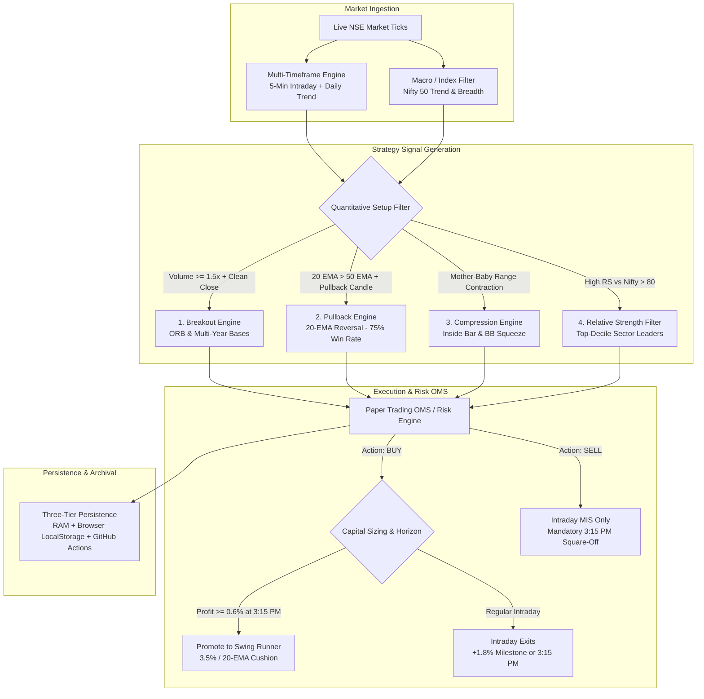

# Pro_T Strategy Engine: Comprehensive Implementation Roadmap & Technical Specification

**Project**: Pro_T Quantitative & Stock Trading Engine  
**Document**: Strategy Architecture, Algorithmic Rules, and Exhaustive Implementation Checklist  
**Version**: 3.0 (Equities + Options Multi-Horizon Framework)  
**Location**: `docs/STRATEGY_ROADMAP_AND_SPECIFICATION.md` & Root `STRATEGY_ROADMAP.md`  

---

## 🧭 Executive Overview & Strategy Philosophy

The goal of the Pro_T Strategy Engine is to operate an **autonomous, positive-expectancy trading system** tailored for Indian stock and derivatives markets (NSE/BSE). 

By synthesizing quantitative intraday momentum, price-action patterns, order flow dynamics, and the institutional frameworks documented in the **CA Rachana Ranade Technical Analysis Masterclasses**, the engine deploys capital across two primary horizons:
1. **Intraday Alpha (MIS)**: Rapid momentum scalping and trend continuation (ORB, 20-EMA pullbacks, Inside Bar breakouts) with strict 3:15 PM EOD square-offs.
2. **Positional Swing Runners (CNC/Delivery)**: Multi-week trend riding (+10% to +30% targets) anchored to daily 20-EMAs and structural swing pivots, protected against overnight volatility.

---

## 📋 Complete Implementation Checklist & Workstreams

---

### Workstream 1: Signal Generation & Setup Enhancement (`stockSignalEngine.js`)

- [x] **1.1. Intraday Opening Range Breakout (ORB)**
  - *Status*: Implemented.
  - *Mechanism*: Tracks 15-minute high/low (9:15–9:30 AM IST). Triggers BUY above ORB High, SELL below ORB Low.
- [ ] **1.2. Volume Surge Filter (Breakout vs. Fakeout — CA Rachana Session 07 & 16)**
  - *Requirement*: Eliminate false breakdowns (like the Sep 16 Reliance/ICICI bear traps).
  - *Rule*: A breakout candle MUST register trading volume $\ge 1.5\times$ to $2.0\times$ its 20-period moving average.
  - *Candle Quality*: Candle body must close in the top 25% of its range for a BUY (or bottom 25% for a SELL). Reject candles with long opposite wicks.
- [x] **1.3. 20-EMA / 50-EMA Trend Pullback ("RR Trending Strategy" — Session 29)**
  - *Status*: Core logic present; produced **75% win rate** on Sep 17 audit.
  - *Requirement*: Prioritize this setup over ORB on trending days.
  - *Rule*: $20\text{ EMA} > 50\text{ EMA}$ on 5-min and Daily charts. Price pulls back into the 20–50 EMA band. Bullish reversal candle (Hammer, Green Engulfing) triggers entry on the break of its high.
- [ ] **1.4. Volatility Compression & Inside Bar Strategy (Session 19 & 31)**
  - *Requirement*: Trade explosive expansions from tight consolidation rather than wide-ranging exhaustion moves.
  - *Rule*: Identify an Inside Bar (high < mother candle high, low > mother candle low). Trigger order placed 1 tick outside the mother candle's boundary. Stop-loss placed at the inside bar extreme (providing high-leverage 1:2 to 1:3 R:R).
- [ ] **1.5. Top-Down Relative Strength (RS) & Sector Alignment (Session 02 & 06)**
  - *Requirement*: Never trade stocks in isolation.
  - *Rule*: Gating filter requiring the stock’s relative strength versus Nifty 50 over rolling 5 and 20 sessions to be positive ($RS > 0$). Only buy stocks that fall less than Nifty during index pullbacks.
- [ ] **1.6. Classical Demand-Supply Order Block Detection (Session 16)**
  - *Requirement*: Detect high-volume consolidation bases that preceded prior rallies. Prevent shorting directly into institutional demand zones.

---

### Workstream 2: Dynamic Trade Management & Target Calibration (`paperTradingService.js`)

- [x] **2.1. Stage 1: Breakeven Ratchet (+0.8% Gain)**
  - *Status*: Implemented.
  - *Rule*: Once floating profit reaches $+0.8\%$, move stop-loss to entry price.
- [x] **2.2. Stage 2: Aggressive Profit Trail (+1.4% Gain)**
  - *Status*: Implemented.
  - *Rule*: Once floating profit reaches $+1.4\%$, trail stop-loss to lock in $+0.8\%$ minimum gain.
- [x] **2.3. Stage 3: Intraday Profit-Take Milestone (+1.8% Gain)**
  - *Status*: Implemented.
  - *Rule*: For large-cap equities, automatically bank profit at $+1.8\%$ (`INTRADAY_PROFIT_TARGET_HIT`) rather than letting winners decay into 3:15 PM EOD liquidations.
- [x] **2.4. Swing Volatility Buffer (3.5% / 20-EMA Cushion)**
  - *Status*: Implemented.
  - *Rule*: When an intraday winner is promoted to a multi-week swing runner, anchor stop-loss to the 20-day EMA or entry price $-3.5\%$ (preventing premature next-morning opening-bell stop-outs).
- [x] **2.5. Swing Pyramiding & Breakeven Lock (+3.0% Gain)**
  - *Status*: Implemented in `positionalSignalEngine.js`.
  - *Rule*: Once swing runner advances $+3.0\%$, move stop-loss to breakeven $+0.2\%$, making the position 100% risk-free.
- [x] **2.6. Multi-Week Target Milestone (+30% Roadmap)**
  - *Status*: Implemented.
  - *Rule*: Target expanded to $+30\%$; position trailed along daily 20-EMA until an exit is triggered.

---

### Workstream 3: Compliance, Execution & Risk Controls (`stockExecutionEngine.js`)

- [x] **3.1. Exchange Compliance on Short Selling (NSE/BSE MIS Rule)**
  - *Status*: Implemented.
  - *Rule*: Short cash equity positions (`action: 'SELL'`) are strictly restricted to intraday (MIS) and squared off at 3:15 PM IST. Only `BUY` positions can be promoted to overnight swing runners.
- [x] **3.2. Mandatory 3:15 PM EOD Square-Off**
  - *Status*: Implemented.
  - *Rule*: All non-promoted intraday MIS positions are closed between 3:15 PM and 3:29 PM IST.
- [x] **3.3. Swing Exit Dispatch Execution**
  - *Status*: Implemented.
  - *Rule*: Swings triggered by stop-loss or 30% targets in `positionalSignalEngine` are immediately executed in `paperTrading.closePosition()`.
- [ ] **3.4. Portfolio Drawdown Circuit Breaker**
  - *Requirement*: Protect capital against rare black-swan days.
  - *Rule*: If total realized losses across all positions on a single trading day reach $-2.0\%$ of portfolio equity, halt all new entries for the remainder of the session.
- [ ] **3.5. Maximum Per-Stock Loss Limit**
  - *Requirement*: Limit whipsaws during erratic choppy sessions.
  - *Rule*: Cap entries to a maximum of 2 failed trades per symbol per day.

---

### Workstream 4: Three-Tier State Persistence Architecture

- [x] **4.1. Tier 1: In-Memory / Local JSON State**
  - *Status*: Implemented (`backend/data/paper_portfolio_state.json`).
- [x] **4.2. Tier 2: Browser LocalStorage Hot-Replica**
  - *Status*: Implemented (`StockIntradayWidget.js` in `backend/frontend` and `frontend`).
  - *Recovery*: Auto-restores positions across mid-day Render container restarts via `POST /api/paper/restore-state`.
  - *Multi-Day Swing Support*: Retains swing positions across calendar day rollovers up to 30 days.
- [x] **4.3. Tier 3: GitHub Actions Permanent Database**
  - *Status*: Implemented (`.github/workflows/archive_audit.yml`).
  - *Execution*: Wakes up at 3:35 PM and 4:15 PM IST, downloads state, commits to Git repo, and pushes to `main` and `render-deployment`.
- [x] **4.4. Multi-Source Daily Ledger Synchronization**
  - *Status*: Implemented across `email_dispatch_status.json`, `daily_pnl_archive_*.json`, and `daily_pnl_ledger.json`.

---

### Workstream 5: Automated Reporting & Observability

- [x] **5.1. Strict One-Daily-Email Rule (3:30 PM – 5:00 PM IST)**
  - *Status*: Implemented (`emailNotificationService.js`). Blocks night duplicates and non-trading day dispatches.
- [x] **5.2. Weekly Trade Simulation & Signal Audit Logs**
  - *Status*: Implemented (`weeklyAuditLogger.js` and `signalAuditLogger.js`).
- [ ] **5.3. Strategy Attribution Tagging**
  - *Requirement*: Measure exact P&L and win rate per strategy.
  - *Rule*: Tag each closed trade in the ledger with its entry model:
    - `SETUP_ORB_BREAKOUT`
    - `SETUP_20_EMA_PULLBACK`
    - `SETUP_INSIDE_BAR`
    - `SETUP_SWING_RUNNER`

---

## 🎯 Implementation Priority Matrix

| Phase | Component | Feature Description | Complexity | Priority |
| :--- | :--- | :--- | :--- | :--- |
| **Phase 1** | `stockSignalEngine.js` | **1.5x Volume Surge Filter** on ORB breakouts (stops false breakdown traps) | Low | **Immediate** |
| **Phase 1** | `stockSignalEngine.js` | **Candle Quality / Wick Rejection Guard** | Low | **Immediate** |
| **Phase 2** | `stockSignalEngine.js` | **Inside Bar Compression Detector** (high-RRR compression entries) | Medium | **High** |
| **Phase 2** | `stockMarketDataProvider.js` | **Nifty 50 Relative Strength (RS) Gating** | Medium | **High** |
| **Phase 3** | `stockExecutionEngine.js` | **Portfolio -2% Daily Drawdown Circuit Breaker** | Low | **Medium** |
| **Phase 3** | `weeklyAuditLogger.js` | **Strategy Attribution Tagging** (`SETUP_*`) | Low | **Medium** |

---

## 📍 File Locations & Cross-References

| Area | Key File | Purpose |
| :--- | :--- | :--- |
| **Strategy Roadmap** | [STRATEGY_ROADMAP.md](file:///c:/Users/jaiad/Personal_Work_Related/Personal%20Projects/Pro_T/Application_transfer/STRATEGY_ROADMAP.md) | Permanent workspace root reference |
| **Technical Documentation** | [docs/STRATEGY_ROADMAP_AND_SPECIFICATION.md](file:///c:/Users/jaiad/Personal_Work_Related/Personal%20Projects/Pro_T/Application_transfer/docs/STRATEGY_ROADMAP_AND_SPECIFICATION.md) | Deep technical documentation |
| **Lecture Summaries** | [ca_rachana_technical_analysis_transcripts/SESSION_SUMMARIES_AND_CORE_CONCEPTS.md](file:///c:/Users/jaiad/Personal_Work_Related/Personal%20Projects/Pro_T/ca_rachana_technical_analysis_transcripts/SESSION_SUMMARIES_AND_CORE_CONCEPTS.md) | Underlying research & rulebook |
| **Signal Engine** | [backend/services/stockSignalEngine.js](file:///c:/Users/jaiad/Personal_Work_Related/Personal%20Projects/Pro_T/Application_transfer/backend/services/stockSignalEngine.js) | Real-time signal generation |
| **Swing Engine** | [backend/services/positionalSignalEngine.js](file:///c:/Users/jaiad/Personal_Work_Related/Personal%20Projects/Pro_T/Application_transfer/backend/services/positionalSignalEngine.js) | Multi-day swing evaluations & pyramiding |
| **Execution Engine** | [backend/services/stockExecutionEngine.js](file:///c:/Users/jaiad/Personal_Work_Related/Personal%20Projects/Pro_T/Application_transfer/backend/services/stockExecutionEngine.js) | Trade execution & square-offs |
| **Paper Trading OMS** | [backend/services/paperTradingService.js](file:///c:/Users/jaiad/Personal_Work_Related/Personal%20Projects/Pro_T/Application_transfer/backend/services/paperTradingService.js) | Position lifecycle, stops & targets |
